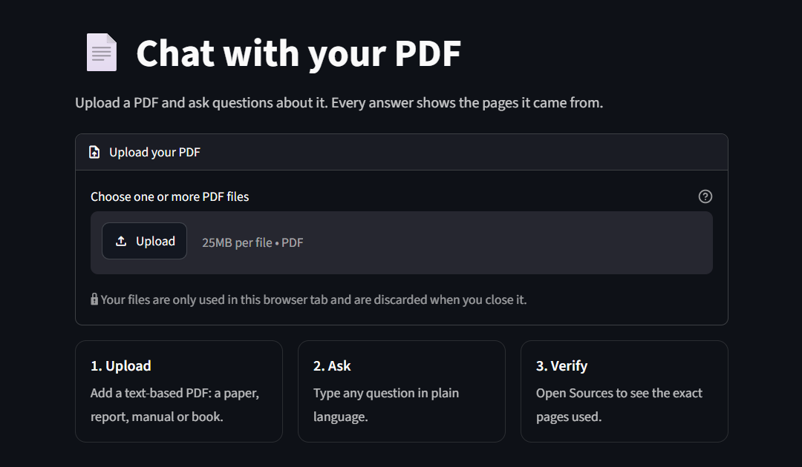

# 📄 Chat with your PDF

Upload a PDF, ask questions about it, and get answers that cite the pages they came from.

[](https://chat-with-your-pdf0.streamlit.app/)

[](LICENSE)

**Live demo: [chat-with-your-pdf0.streamlit.app](https://chat-with-your-pdf0.streamlit.app/)**



## Features

- **Cited answers.** Every answer lists its sources (file and page) with the exact passage, and the model is told to answer only from those passages.
- **Reranked retrieval.** FAISS fetches 20 candidate passages; a cross-encoder reorders them and keeps the best 5.
- **Says when it doesn't know.** If even the best passage scores too low, the app answers "I couldn't find that in the document" instead of guessing.
- **Follow-up questions.** A follow-up is rewritten into a standalone question using the recent chat before searching.
- **Streaming.** Answers appear as they are written.
- **Private per session.** Uploads are indexed in memory for your browser tab only; the uploaded file is deleted right after its text is read.

Text-based PDFs up to 25 MB each, several at once. Scanned or image-only PDFs aren't supported. The demo allows 30 questions per session.

## How it works

```
PDF → pages (pypdf) → 1,000-char chunks (200 overlap) → MiniLM embeddings → FAISS
question → top 20 by cosine → cross-encoder rerank → top 5 → LLM on Groq → streamed, cited answer
```

| Step | Model / tool |
|---|---|
| Embeddings | `all-MiniLM-L6-v2` (SentenceTransformers) |
| Vector search | FAISS `IndexFlatIP` on normalized vectors (cosine) |
| Reranker | `cross-encoder/ms-marco-MiniLM-L-6-v2` |
| Answer | `qwen/qwen3.8-27b` via Groq (LangChain `ChatGroq`) |

## Evaluation

A small retrieval check on the sample documents in [`data/`](data/): 6 questions, top 5 of 20 candidates.

| Pipeline | hit@5 | MRR |
|---|---|---|
| Dense only (FAISS cosine) | 0.83 | 0.71 |
| Dense + cross-encoder rerank | 1.00 | 0.81 |

With reranking, 5 of 6 answers (83%) were judged fully supported by the retrieved passages (LLM judge). Six questions is a sanity check, not a benchmark. Full report: [`eval/EVAL.md`](eval/EVAL.md).

```bash
python -m eval.run_eval                  # retrieval metrics, no API key needed
python -m eval.run_eval --faithfulness   # also grades answers (needs GROQ_API_KEY)
```

## Run locally

Requires Python 3.12+ and a free [Groq API key](https://console.groq.com).

```bash
git clone https://github.com/SamirHossain2001/Chat-With-Your-PDF.git
cd Chat-With-Your-PDF

pip install -r requirements.txt      # or: uv sync

echo "GROQ_API_KEY=your_key_here" > .env

streamlit run app.py
```

On Streamlit Community Cloud, set `GROQ_API_KEY` in the app's secrets instead of `.env`.

<details>
<summary>Configuration</summary>

Settings live in [`src/config.py`](src/config.py) and can be overridden with environment variables or `.env`:

| Variable | Default |
|---|---|
| `EMBEDDING_MODEL` | `all-MiniLM-L6-v2` |
| `RERANKER_MODEL` | `cross-encoder/ms-marco-MiniLM-L-6-v2` |
| `LLM_MODEL` | `qwen/qwen3.8-27b` |
| `CHUNK_SIZE` / `CHUNK_OVERLAP` | `1000` / `200` |
| `RETRIEVE_CANDIDATES` / `TOP_K` | `20` / `5` |
| `MIN_RERANK_SCORE` | `-4.0` (below this, the app abstains) |
| `MAX_QUESTIONS_PER_SESSION` | `30` |

</details>

## Project structure

```
app.py              Streamlit UI
src/
  config.py         settings (models, chunking, retrieval)
  data_loader.py    PDF loading (plus a multi-format loader for local use)
  embedding.py      chunking + embeddings
  vectorstore.py    FAISS index
  search.py         retrieval, reranking, prompts, streaming answers
eval/               retrieval + faithfulness evaluation
notebook/           exploration notebooks (uv sync --group notebooks)
data/               sample documents used by the evaluation
```

## License

[MIT](LICENSE) © 2026 SamirHossain2001
